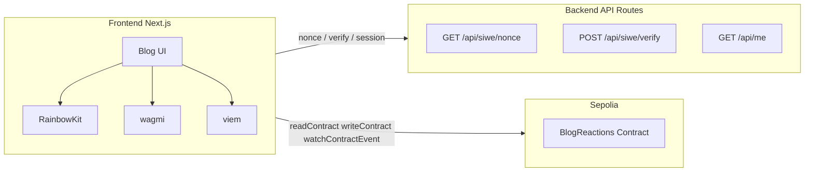
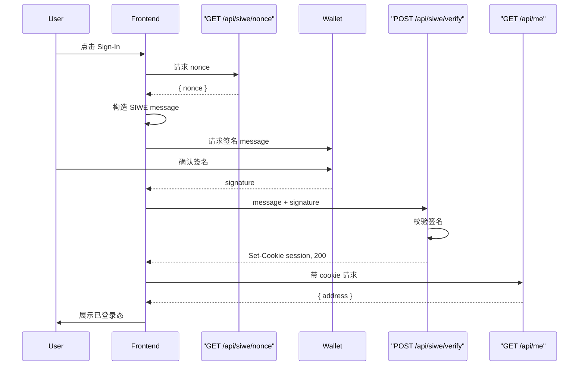

# Web3 博客产品需求文档（PRD）

## 1. 文档信息

| 项目       | 说明 |
| ---------- | ---- |
| 产品名称   | Web3 博客（Web2 Blog + Web3 Identity + On-chain Like/Tip） |
| 文档版本   | 1.0 |
| 文档状态   | 初稿 |
| 最后更新   | （待填写） |
| 负责人     | （待填写） |

本 PRD 描述「博客 + 钱包登录 + 链上点赞/打赏」的产品与实现范围，覆盖前端（Next.js）、后端（API Routes）、智能合约（Sepolia）及 SIWE 登录流程，便于开发落地与简历/README 引用。

---

## 2. 产品概述与目标

### 2.1 产品愿景

构建 **Web2 博客 + Web3 身份 + 链上互动** 的小闭环：既可作为真实作品在个人博客使用，也可作为可验证项目写进简历。

### 2.2 核心目标

- 用户使用**钱包登录（SIWE）**，获得服务端可验证的「已登录」态（Session）。
- 对文章进行**链上点赞**与 **ETH 打赏**，数据可查、不可篡改。
- 前端基于**链上数据与合约事件**做实时反馈（读写分离 + 事件驱动）。

### 2.3 目标用户

- **博客读者**：连接钱包、签名登录、对文章点赞与打赏。
- **博客作者**：查看链上点赞/打赏数据、接收打赏 ETH。

### 2.4 简历/技术亮点关键词

- **SIWE**（Sign-In with Ethereum）
- **Wallet Auth**
- **On-chain interaction**
- **Event-driven UI**

---

## 3. 系统架构

### 3.1 架构图



### 3.2 技术栈

| 层级   | 技术 |
| ------ | ---- |
| 前端 | Next.js、RainbowKit、wagmi、viem、SIWE（前端构造 message + 钱包签名） |
| 后端 | Next.js API Routes，SIWE 校验、Session/Cookie（如 httpOnly） |
| 链与合约 | Sepolia 网络；Solidity 合约（点赞 + 打赏 + 事件） |

### 3.3 与现有博客的关系

- 文章数据仍来自现有 **content/blog**（MDX/MD）与 **getPostBySlug(slug)**（见 `src/lib/content/blog.ts`）。
- 链上仅用 **postId** 与文章一一对应，postId 由文章 **slug** 派生，见第 4 节。

---

## 4. 核心概念与约束

### 4.1 postId

- **定义**：`bytes32 postId = keccak256(utf8(slug))`
- **约定**：前端、后端、合约统一使用同一规则生成 postId。
- **JS/viem**：`keccak256(toBytes(slug))`（UTF-8 编码）。
- 保证同一篇文章在链上具有**稳定、唯一**的标识；slug 变化则 postId 变化（合理）。

### 4.2 登录定义

- **仅「连接钱包」**：不算登录，仅表示前端已拿到 `address`。
- **已登录**：SIWE 验证通过且服务端已下发 Session（如 httpOnly cookie）后，视为「已登录」。

### 4.3 「登录后才能点赞」策略

- 采用 **方案 A**：仅前端限制。
  - 连接钱包且完成 SIWE 登录后，才展示 Like 按钮与打赏入口。
  - 合约层不校验「是否在站点登录过」；链上只认 `address`。
- 方案 B（合约侧校验站点许可/allowlist）为可选进阶，本 PRD 不做要求。

---

## 5. 第一阶段：Wallet as Auth（用钱包当登录）

### 5.1 功能清单

1. **接入 RainbowKit + wagmi**
   - 提供：`isConnected`、`address`、`chainId`、`connect`、`disconnect`。
2. **前端状态与 UI**
   - 未连接：展示「Connect Wallet」。
   - 已连接未 SIWE：展示「Sign-In」。
   - 已登录：展示个人入口（如「我的点赞/我的打赏记录」）及可用的点赞/打赏能力。
3. **SIWE 标准流程（必选）**
   1. 前端请求 `GET /api/siwe/nonce` 获取随机 nonce。
   2. 前端构造 SIWE message（含 domain、uri、chainId、nonce、statement）。
   3. 用户使用钱包对 message 签名（不消耗 gas）。
   4. 前端将 message + signature 提交至 `POST /api/siwe/verify`。
   5. 后端校验签名通过后，写入 Session（建议 httpOnly cookie）。
   6. 前端调用 `GET /api/me` 确认登录态（返回 address）。
4. **安全与简历要点**
   - 防重放：nonce 一次性使用。
   - 绑定域名：message 中 domain/uri 与站点一致。
   - 服务端验证签名：身份不可抵赖。

### 5.2 API 规范（摘要）

| 方法 | 路径 | 说明 | 响应 |
| ---- | ---- | ---- | ---- |
| GET  | /api/siwe/nonce  | 获取 SIWE nonce | `{ "nonce": "..." }` |
| POST | /api/siwe/verify | Body: `{ "message", "signature" }`，校验通过后设置 session cookie | 200 成功 / 4xx 失败 |
| GET  | /api/me          | 需要登录；返回当前用户地址 | `{ "address": "0x..." }` 或 401 |

---

## 6. 第二阶段：内容资产化（链上点赞 / 打赏）

### 6.1 合约规约

- **合约名称**：`BlogReactions`（与附录 D 一致）。
- **状态与权限**
  - `author`：immutable，部署时指定，用于接收打赏。
  - `likeCount[postId]`：某文章的点赞总数。
  - `tipTotal[postId]`：某文章收到的打赏总额（ETH）。
  - `liked[postId][user]`：某地址是否已对某文章点赞（防重复）。
- **方法**
  - `like(bytes32 postId)`：要求当前用户未点赞；更新 `liked`、`likeCount`；发出事件 `Liked(postId, user)`。
  - `tip(bytes32 postId) payable`：要求 `msg.value > 0`；累加 `tipTotal`；将 ETH 直接转给 `author`；发出事件 `Tipped(postId, user, amount)`。
- **扩展**：后续可增加 ERC20 打赏（如 `tipERC20(postId, token, amount)` + 用户 `approve` + 合约 `transferFrom`），本 PRD 标为「可选后续迭代」。
- **网络**：主网先采用 **Sepolia**；前端需支持「当前网络 / 请切换到 Sepolia」的提示与切换（wagmi 支持）。

### 6.2 前端交互（读写分离 + 事件驱动）

| 类型     | 方式 | 说明 |
| -------- | ---- | ---- |
| 读       | viem `readContract` | 拉取 `likeCount(postId)`、`tipTotal(postId)`、`liked(postId, address)`（当前用户是否已点赞） |
| 写       | wagmi/viem `writeContract` | 调用 `like(postId)` / `tip(postId)`，用户确认交易并支付 gas |
| 实时反馈 | viem `watchContractEvent` | 监听 `Liked` / `Tipped`；当事件中的 `postId` 与当前文章一致时立即更新 UI（不依赖轮询）；成功 toast 可基于事件而非仅 tx receipt |

### 6.3 文章页与全局 UI 需求

**文章页**（与现有 `src/app/blog/[slug]/page.tsx` 集成）

- 展示链上「点赞数」「打赏总额」。
- 展示「当前用户是否已点赞」。
- Like 按钮：仅登录后可用；已点赞则禁用（链上 + 前端双重防止重复）。
- 打赏入口：金额输入 + 调用 `tip(postId)` 发起交易。

**顶部/全局**

- 显示「Connected: 0x…」与「Signed in (SIWE)」状态。
- 网络提示：「当前 Sepolia / 请切换网络」按钮或提示（wagmi 支持）。

---

## 7. 非功能需求

- **安全**：SIWE nonce 一次性使用；签名仅在服务端校验；Session 使用 httpOnly cookie，避免 XSS 窃取。
- **体验**：Like/打赏提交后展示 pending 状态；成功由事件驱动更新 UI 并可选 toast；打赏同理。
- **兼容**：与现有 MDX 博客、路由、布局（`layout.tsx`、`site-header`）共存，不破坏现有 SEO 与访问路径。

---

## 8. 里程碑与交付物

| 阶段 | 内容 | 交付物 |
| ---- | ---- | ------ |
| Phase 1：Wallet as Auth | RainbowKit/wagmi 接入；SIWE nonce/verify/me API + Session；前端登录态与「Sign-In」流程 | 用户可连接钱包并完成 SIWE 登录，前端展示登录态 |
| Phase 2：On-chain Like/Tip | 合约部署至 Sepolia；文章页读/写/事件监听；Like + Tip UI；网络提示与切换 | 用户可对文章点赞与打赏，UI 实时更新 |
| 文档与对外 | README 更新；架构图、SIWE 流程图、合约地址 + Etherscan；Demo 视频/GIF | 简历可引用「SIWE + Wallet Auth + On-chain interaction + Event-driven UI」 |

---

## 9. 附录

### 附录 A. SIWE 登录流程图



### 附录 B. 合约事件与前端监听

- **Liked**：`event Liked(bytes32 indexed postId, address indexed user)`
  - 前端 `watchContractEvent` 监听 `Liked`，筛选 `postId === currentPostId` 后更新点赞数与「已点赞」状态。
- **Tipped**：`event Tipped(bytes32 indexed postId, address indexed user, uint256 amount)`
  - 同上，筛选 `postId === currentPostId` 后更新打赏总额并可选 toast。

indexed 参数便于按 `postId` 过滤，减少无关事件处理。

### 附录 C. postId 生成约定

- **统一规则**：`bytes32 postId = keccak256(toBytes(slug))`
- **编码**：slug 按 UTF-8 编码为 bytes 后再做 keccak256。
- **viem 示例**：`import { keccak256, toBytes } from 'viem'; const postId = keccak256(toBytes(slug));`
- 前后端与合约均采用此规则，保证同一文章在链上标识一致。

### 附录 D. 参考合约代码（BlogReactions）

```solidity
// SPDX-License-Identifier: MIT
pragma solidity ^0.8.20;

contract BlogReactions {
    address public immutable author;

    mapping(bytes32 => uint256) public likeCount;
    mapping(bytes32 => uint256) public tipTotal;
    mapping(bytes32 => mapping(address => bool)) public liked;

    event Liked(bytes32 indexed postId, address indexed user);
    event Tipped(bytes32 indexed postId, address indexed user, uint256 amount);

    constructor(address _author) {
        author = _author;
    }

    function like(bytes32 postId) external {
        require(!liked[postId][msg.sender], "Already liked");
        liked[postId][msg.sender] = true;
        likeCount[postId] += 1;
        emit Liked(postId, msg.sender);
    }

    function tip(bytes32 postId) external payable {
        require(msg.value > 0, "No value");
        tipTotal[postId] += msg.value;

        // 直接转给作者（简洁直观）
        (bool ok, ) = author.call{value: msg.value}("");
        require(ok, "Transfer failed");

        emit Tipped(postId, msg.sender, msg.value);
    }
}
```

部署时传入作者地址 `_author`；建议先部署至 Sepolia，并在 README 中注明合约地址与 Etherscan 链接。
